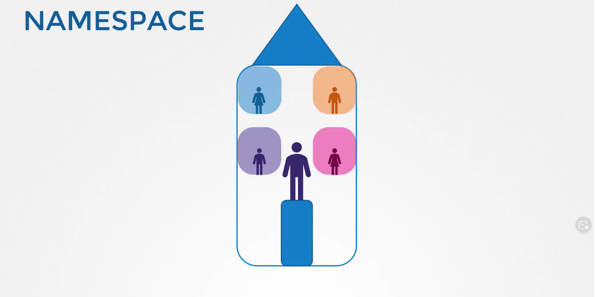
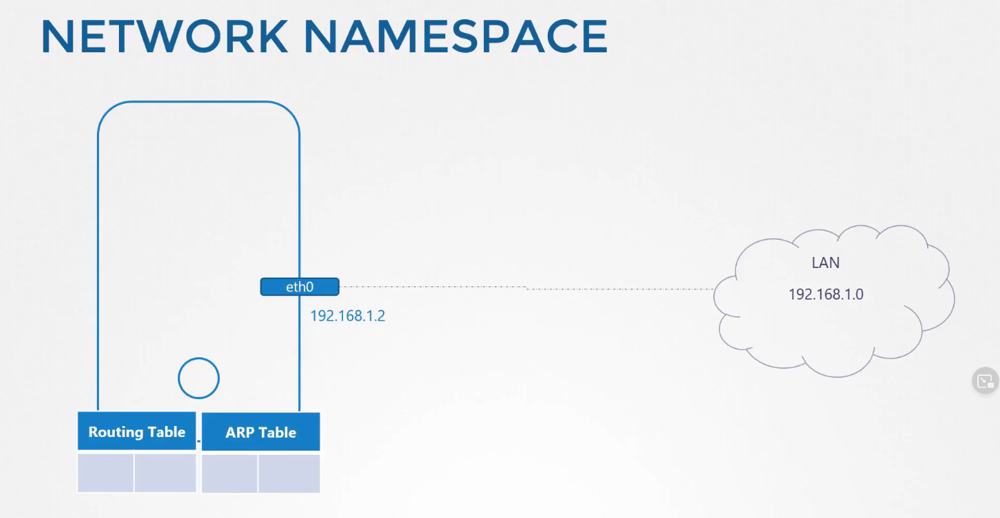
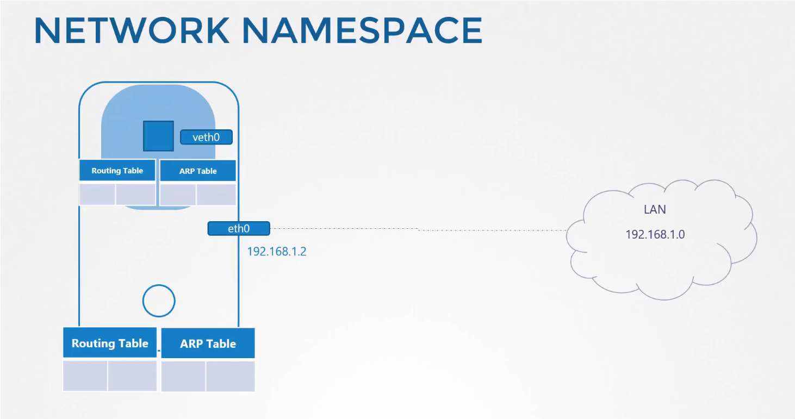

# নেটওয়ার্ক নেমস্পেস 

আমরা অনেকেই হয়তো জানি Docker,  নেটওয়ার্ক নেমস্পেস ব্যবহার করে নেটওয়ার্ক আইসোলেসন ইমপ্লিমেন্ট করে। 

মানে Docker এ কন্টেইনারগুলো নেমস্পেস ব্যবহার করে হোস্ট থেকে পৃথক থাকে। এখন নেমস্পেস ব্যবহার করে কিভাবে পৃথক থাকে তা জানতে হলে আগে নেমস্পেস নিয়ে ভালোভাবে জানতে হবে। চলুন প্রথমে নেমস্পেস কি সেইটা ভালো ভাবে জেনে নেই। 

 

ধরি, আমাদের হোস্ট যে ডিভাইস আছে সেটি আমাদের বাড়ি এবং আমাদের যেই রুমগুলো আছে সেগুলো হচ্ছে এক একটা নেমস্পেস। নিজেদের গোপনীয়তা রক্ষাকরার জন্য বাড়ির প্রত্যেক বাচ্চাদেরকে একটি করে রুম এস্যাইন করেছি। এই রুমগুলো ব্যবহার করে বাচ্চারা নিজেদের মধ্যে গোপনীয়তা রক্ষা করছে, তারা কেউই অন্য রুমগুলোতে কি হছে সেটা জানেনা। কিন্তু আপনি বাড়ির কর্তা হিসেবে আপনার সকল রুমগুলোতে কি হচ্ছে তা দেখতে পারছেন এবং বাড়ির কোথায় কি হচ্ছে এসব ব্যাপারও পর্যবেক্ষণ করতে পারছেন এবং আপনি যদি চান তাহলে রুমগুলোএর মধ্যে যোগাযোগ করার জন্য রাস্তা তৈরি করে দিতে পারেন। 

 

 যখন আমরা একটি কন্টেইনার তৈরি করি আমরা চাই এই কন্টেইনারটি যাতে হোস্ট থেকে আইসোলেটেড থাকে, হোস্টের কোন প্রসেস বা অন্য কন্টেইনারকে না দেখতে পারে। এই কাজটি করার জন্য আমারা আমাদের হোস্টে একটি স্পেশাল রুম তৈরি করি নেমস্পেস ব্যবহার করে এর ফলে এই কন্টেইনারটি নিজের মধ্যে কি প্রসেস চলছে এগুলো ছাড়া অন্যকিছু দেখতে পারেনা এবং নিজেকেই হোস্ট মনেকরে। 

  

কিন্তু হোস্ট সলক প্রসেসই দেখতে পারে এমন কি কন্টেইনারের মধ্যে যেসব প্রসেস চলছে সেগুলোও দেখতে পারে। কন্টেইনারের মধ্যে যে প্রসেসগুলো চলে কন্টেইনার সেগুলোকে 1 থেকে নাম্বারিং শুরু করে কিন্তু ওই একই প্রসেস হোস্ট এ অন্য নাম্বারে থাকে। 

  

# নেটওয়ার্ক 

আমাদের হোস্টের একটি ইন্টারফেস(eth0) থাকে যেটির মাধ্যমে এটি LAN এর সাথে কানেক্ট হয়। এবং আমাদের হোস্টের নিজস্ব ARP Table , Routing Table এবং নেটওয়ার্ক সম্পর্কে আরও তথ্য থাকে। 

  

যখন একটি কন্টেইনার তৈরি করা হয় আমারা এই কন্টেইনারের জন্য একটি নেটওয়ার্ক নেমস্পেস তৈরি করি এবং হোস্টের কোন প্রসেস বা নেটওয়ার্ক রিলেটেড কোন তথ্য এই কন্টেইনারের কাছে থাকেনা। এই নেমস্পেসের ভেতরে কন্টেইনারের নিজস্ব ভার্চুয়াল ইন্টারফেস, ARP Table এবং Routing Table থাকতে পারে। 

  

নেটওয়ার্ক নেমস্পেস তৈরি করার কমান্ড

```bash
# আমরা রেড এবং ব্লু নামের দুটি নেমস্পেস তৈরি করছি 
sudo ip netns add red
sudo ip netns add blue
# command to see network namespace
ip netns
# to see interfaces under the namespace
sudo ip netns exec red ip link
```


আমরা যেদুটি নেমস্পেস তৈরি করেছি এগুলোর কাছে হোস্টের নেটওয়ার্কের কোন তথ্য নেই, এদের নিজেদের কোন ইন্টারফেস নেই। নিচের কমান্ডটি রান করলে দেখতে পাবেন লুপব্যাক ছাড়া কোন ইন্টারফেস নেই। 

```bash
sudo ip netns exec red ip link
sudo ip netns exec blue ip link
```

চলুন আমরা দুটি নেমস্পেসের মধ্যে কানেকশন তৈরি করি। আমরা যেভাবে ethernet ইন্টারফেসে তার লাগিয়ে দুটি ডিভাইসকে সংযুক্ত করি সেরকমই আমরা ভার্চুয়াল ethernet pair ব্যবহার করে দুটি নেমস্পেসকে যুক্ত করতে পারি। 


```bash
sudo ip link add veth-red type veth peer name veth-blue
```


আমরা যেই ভার্চুয়াল ethernet peer তৈরি করেছি এটিকে এখন নেমস্পেসের সাথে যুক্ত করবো

```
sudo ip link set veth-red netns red
```


```
sudo ip link set veth-blue netns blue
```


```bash
ip --all netns exec ip link

# response


netns: blue
1: lo: <LOOPBACK> mtu 65536 qdisc noop state DOWN mode DEFAULT group default qlen 1000
    link/loopback 00:00:00:00:00:00 brd 00:00:00:00:00:00
7: veth-blue@if8: <BROADCAST,MULTICAST> mtu 1500 qdisc noop state DOWN mode DEFAULT group default qlen 1000
    link/ether 52:20:68:67:87:bb brd ff:ff:ff:ff:ff:ff link-netns red

netns: red
1: lo: <LOOPBACK> mtu 65536 qdisc noop state DOWN mode DEFAULT group default qlen 1000
    link/loopback 00:00:00:00:00:00 brd 00:00:00:00:00:00
8: veth-red@if7: <BROADCAST,MULTICAST> mtu 1500 qdisc noop state DOWN mode DEFAULT group default qlen 1000
    link/ether 0a:dd:75:d2:4a:f0 brd ff:ff:ff:ff:ff:ff link-netns blue
    
#########################

sudo ip --all netns ip addr

# response


netns: blue
1: lo: <LOOPBACK> mtu 65536 qdisc noop state DOWN mode DEFAULT group default qlen 1000
    link/loopback 00:00:00:00:00:00 brd 00:00:00:00:00:00
7: veth-blue@if8: <BROADCAST,MULTICAST> mtu 1500 qdisc noop state DOWN mode DEFAULT group default qlen 1000
    link/ether 52:20:68:67:87:bb brd ff:ff:ff:ff:ff:ff link-netns red

netns: red
1: lo: <LOOPBACK> mtu 65536 qdisc noop state DOWN mode DEFAULT group default qlen 1000
    link/loopback 00:00:00:00:00:00 brd 00:00:00:00:00:00
8: veth-red@if7: <BROADCAST,MULTICAST> mtu 1500 qdisc noop state DOWN mode DEFAULT group default qlen 1000
    link/ether 0a:dd:75:d2:4a:f0 brd ff:ff:ff:ff:ff:ff link-netns blue

netns: prod
1: lo: <LOOPBACK,UP,LOWER_UP> mtu 65536 qdisc noqueue state UNKNOWN mode DEFAULT group default qlen 1000
    link/loopback 00:00:00:00:00:00 brd 00:00:00:00:00:00
5: veth-prod@if6: <BROADCAST,MULTICAST,UP,LOWER_UP> mtu 1500 qdisc noqueue state UP mode DEFAULT group default qlen 1000
    link/ether 3a:1c:b1:8f:d6:4c brd ff:ff:ff:ff:ff:ff link-netns dev

netns: dev
1: lo: <LOOPBACK,UP,LOWER_UP> mtu 65536 qdisc noqueue state UNKNOWN mode DEFAULT group default qlen 1000
    link/loopback 00:00:00:00:00:00 brd 00:00:00:00:00:00
6: veth-dev@if5: <BROADCAST,MULTICAST,UP,LOWER_UP> mtu 1500 qdisc noqueue state UP mode DEFAULT group default qlen 1000
    link/ether b6:9c:61:b8:3f:d8 brd ff:ff:ff:ff:ff:ff link-netns prod


 sudo ip --all netns exec ip addr

netns: blue
1: lo: <LOOPBACK> mtu 65536 qdisc noop state DOWN group default qlen 1000
    link/loopback 00:00:00:00:00:00 brd 00:00:00:00:00:00
7: veth-blue@if8: <BROADCAST,MULTICAST> mtu 1500 qdisc noop state DOWN group default qlen 1000
    link/ether 52:20:68:67:87:bb brd ff:ff:ff:ff:ff:ff link-netns red

netns: red
1: lo: <LOOPBACK> mtu 65536 qdisc noop state DOWN group default qlen 1000
    link/loopback 00:00:00:00:00:00 brd 00:00:00:00:00:00
8: veth-red@if7: <BROADCAST,MULTICAST> mtu 1500 qdisc noop state DOWN group default qlen 1000
    link/ether 0a:dd:75:d2:4a:f0 brd ff:ff:ff:ff:ff:ff link-netns blue
```

আমরা দুটি নেমস্পেসকে ভার্চুয়াল ethernet peer এর মাধ্যমে যুক্ত করে ফেলেছি। এখন নেমস্পেসগুলোতে আমাদের IP address আস্যাইন করতে হবে। 

```bash
ip -n red addr add 192.168.15.1 dev veth-red
ip -n blue addr add 192.168.15.2 dev veth-blue
```

```bash
sudo ip -n red link set veth-red up
sudo ip -n red link set lo up
sudo ip -n blue link set veth-blue up
sudo ip -n blue link set lo up
```


আমরা নেমস্পেস দুটিতে IP address আস্যাইন করে ফেলেছি কিন্তু এখনো আমরা এক নেমস্পেস থেকে অন্য নেমস্পেসে ping করতে পারবোনা কারণ নেমস্পেস গুলো জানেনা কোন route এ প্যাকেটগুলো পাঠাবে। এখন আমরা route বলে দিবো 

```
sudo ip netns exec red ip route add default via 192.168.15.1 dev veth-red

sudo ip netns exec blue ip route add default via 192.168.15.2 dev veth-blue
```
এখন আমরা রেড নেমস্পেস থেকে ব্লু নেমস্পেসে পিং করতে পারবো 

```bash
sudo ip netns exec red ping 192.168.15.2

# response

PING 192.168.15.2 (192.168.15.2) 56(84) bytes of data.
64 bytes from 192.168.15.2: icmp_seq=1 ttl=64 time=0.055 ms
64 bytes from 192.168.15.2: icmp_seq=2 ttl=64 time=0.037 ms
64 bytes from 192.168.15.2: icmp_seq=3 ttl=64 time=0.064 ms
64 bytes from 192.168.15.2: icmp_seq=4 ttl=64 time=0.055 ms
```