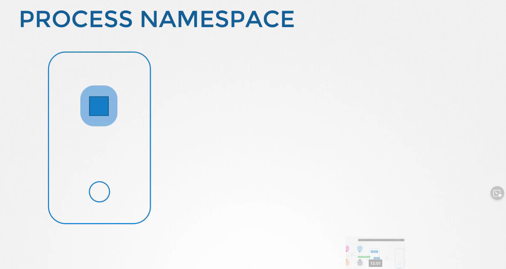
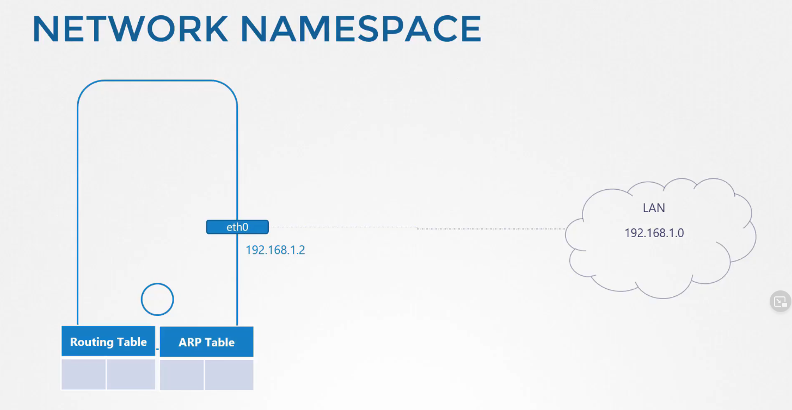
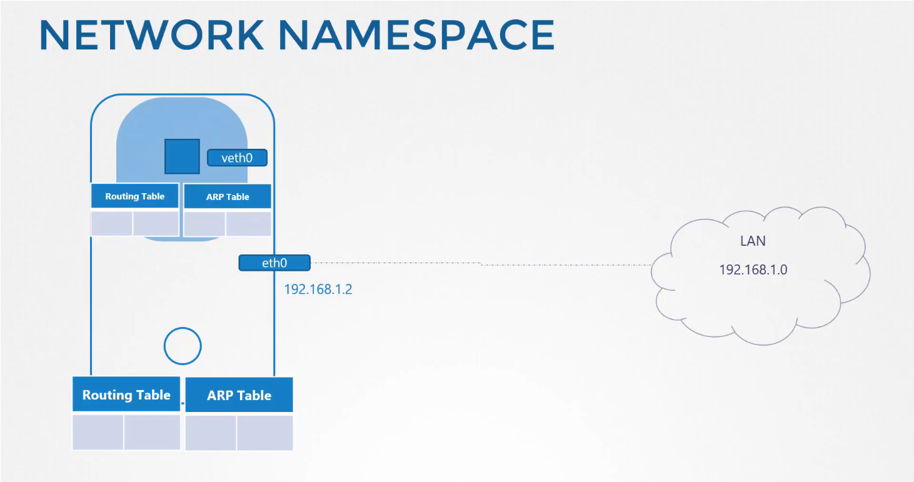

# ডকার নেটওয়ার্কিং

Docker নেটওয়ার্ক নেমস্পেস ব্যবহার করে নেটওয়ার্ক আইসোলেসন ইমপ্লিমেন্ট করে। 

Docker এ কন্টেইনারগুলো নেমস্পেস ব্যবহার করে হোস্ট থেকে পৃথক থাকে। চলুন নেমস্পেস কি সেইটা ভালো ভাবে জেনে নেই। 

 

 ধরেন আমাদের হোস্ট যে ডিভাইস আছে সেটি আমাদের বাড়ি এবং আমাদের যেই রুমগুলো আছে সেগুলো হচ্ছে এক একটা নেমস্পেস। নিজেদের গোপনীয়তা রক্ষাকরার জন্য বাড়ির প্রত্যেক বাচ্চাদেরকে একটি করে রুম এস্যাইন করেছি। এই রুমগুলো ব্যবহার করে বাচ্চারা নিজেদের মধ্যে গোপনীয়তা রক্ষা করছে, তারা কেউই অন্য রুমগুলোতে কি হছে টা জানেনা। কিন্তু আপনি বাড়ির কর্তা হিসেবে আপনার সকল রুমগুলোতে কি হচ্ছে তা দেখতে পারছেন এবং বাড়ির কোথায় কি হচ্ছে এসব ব্যাপারও পর্যবেক্ষণ করতে পারছেন এবং আপনি যদি চান তাহলে রুমগুলোএর মধ্যে যোগাযোগ করার জন্য রাস্তা তৈরি করে দিতে পারেন। 

 

 যখন আপরা একটি কন্টেইনার তৈরি করি আমরা চাই এই কন্টেইনারটি যাতে হোস্ট থেকে আইসোলেটেড থাকে, হোস্টের কোন প্রসেস বা অন্য কন্টেইনারকে না দেখতে পারে। এই কাজটি করার জন্য আমারা আমাদের হোস্টে একটি স্পেশাল রুম তৈরি করি নেমস্পেস ব্যবহার করে এর ফলে এই কন্টেইনারটি নিজের মধ্যে কি প্রসেস চলছে এগুলো ছাড়া অন্যকিছু দেখতে পারেনা এবং নিজেকেই হোস্ট মনেকরে। 

  

কিন্তু হোস্ট সলক প্রসেসই দেখতে পারে এমন কি কন্টেইনারের মধ্যে যেসব প্রসেস চলছে সেগুলোও দেখতে পারে। কন্টেইনারের মধ্যে যে প্রসেসগুলো চলে কন্টেইনার সেগুলোকে 1 থেকে নাম্বারিং শুরু করে কিন্তু ওই একই প্রসেস হোস্ট এ অন্য নাম্বারে থাকে এইটা কিভাবে কাজ করে অন্যসময় আলোচনা করবো। 

# নেটওয়ার্ক 

আমাদের হোস্টের একটি ইন্টারফেস(eth0) থাকে যেটির মাধ্যমে এটি LAN এর সাথে কানেক্ট হয়। এবং আমাদের হোস্টের নিজস্ব ARP Table , Routing Table এবং নেটওয়ার্ক সম্পর্কে আরও তথ্য থাকে। 

  

যখন একটি কন্টেইনার তৈরি করা হয় আমারা এই কন্টেইনারের জন্য একটি নেটওয়ার্ক নেমস্পেস তৈরি করি এবং হোস্টের কোন প্রসেস বা নেটওয়ার্ক রিলেটেড কোন তথ্য এই কন্টেইনারের কাছে থাকেনা। এই নেমস্পেসের ভেতরে কন্টেইনারের নিজস্ব ভার্চুয়াল ইন্টারফেস, ARP Table এবং Routing Table থাকতে পারে। 

  

নেটওয়ার্ক নেমস্পেস তৈরি করার কমান্ড

```bash
sudo ip netns add red
# command to see network namespace
ip netns
```